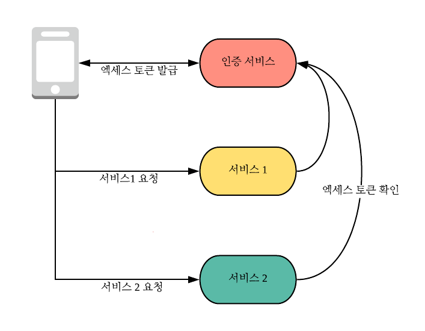
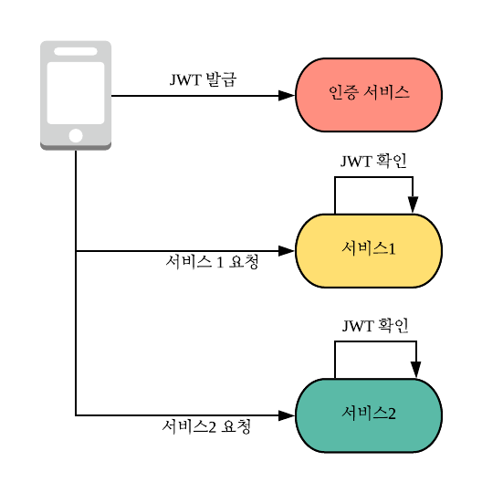
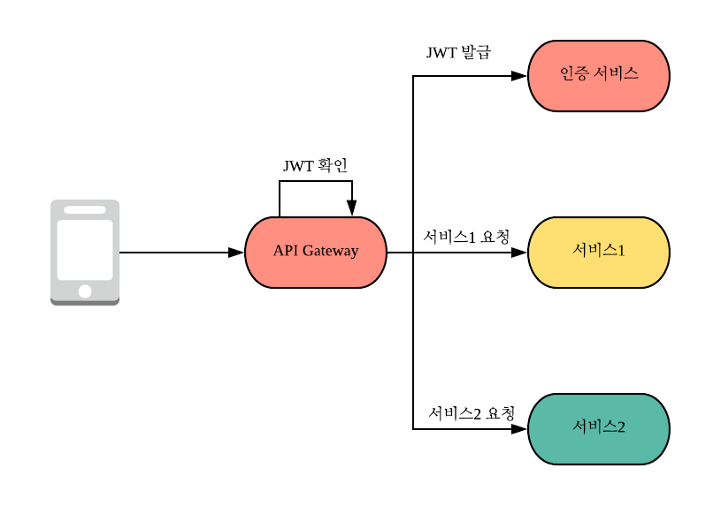

### Ref

https://medium.com/spoontech/%EB%A7%88%EC%9D%B4%ED%81%AC%EB%A1%9C%EC%84%9C%EB%B9%84%EC%8A%A4-%EA%B5%AC%EC%A1%B0-msa-%EC%9D%98-%EC%9D%B8%EC%A6%9D-%EB%B0%8F-%EC%9D%B8%EA%B0%80-authorization-authentication-a595179ab88e

 

### MSA란
---
MSA는 하나의 큰 서비스(Monolithic service)를 작은 서비스 단위로 분리함을 뜻한다. 분리된 서비스들은 서로 의존성을 가질 수 있고, 이는 서비스 간 의존 관계에서 발생할 수 있는 여러 변수를 고려해야 한다는 의미이다. 이로 인해 전체 구현 및 관리의 복잡도가 가중될 수 있다.

나는 현재 진행 중인 프로젝트에서 인증/인가를 가장 먼저 분리할 예정이다. 따라서 오늘은 MSA에서의 인증/인가 아키텍처를 살펴보려 한다.

참고로 토큰 기반의 인증/인가 방식이다.

 

### 아키텍쳐1
---

서비스1, 서비스2가 인증 서비스에 의존하는 관계이다. 인증 서비스에서 장애가 발생하면 전체 서비스에 장애가 전파될 수 있기 때문에 장애 전파를 방지할 수 있는 방법이 필요하다.

 

### 아키텍처2
---

토큰에 대한 검증을 각각의 서비스에서 직접 수행하는 방식이다. 인증에 대한 서비스 간 의존성은 사라졌다.

하지만 발급한 토큰을 관리하기 어렵다는 단점이 있을 수 있다. 

- 접근 제어
  - 발급한 JWT를 블랙리스트로 처리해야 하는 상황이 있을 수 있다. 토큰이 탈취되었거나 로그아웃 한 경우를 예로 들 수 있다.
  - 그런데 이 정도는 Redis나 기타 NoSQL에서 JWT 블랙리스트를 일괄적으로 관리하면 쉽게 해결할 수 있다.  

- 변경된 정보 적용
  - 토큰이 발급된 이후 사용자의 권한 정보가 변경되었을 때 어떻게 해야 할까? 이 또한 토큰을 블랙리스트로 처리하고 토큰 재발급을 유도하면 된다. 사용자의 권한이 변경 될 일이 자주 없을거라고 생각하기 때문이다.

토큰의 수명을 짧게 하는 방법도 하나의 해결책이 될 수 있다. 하지만 토큰 재발급 오버헤드가 증가하기 때문에 적절한 타협이 필요하다고 생각한다.

 

### 아키텍처3
---

맨 앞단에서 API Gateway가 인증/인가 절차를 수행하면 각 서비스가 인증/인가 로직에서 완전히 자유로워질 수 있다.

하지만 API Gateway에서 장애가 발생하면 SPOF가 될 수 있기 때문에 API Gateway를 도입할 땐 이중화가 반드시 고려되어야 한다.

- API Gateway의 이중화
- 전체 시스템 이중화

 

### 글쓴이의 꿀팁
---
글 작성자 분의 꿀팁인 듯 하다. 나는 이 생각을 왜 못했는지 모르겠다 ;

토큰을 이용한 사용자 인증 결과는 가변성이 크지 않다. 따라서 사용자 인증 데이터를 캐시 하여 재사용해도 좋을 것이다. 이는 다음과 같은 이점이 있다.

- 통신 오버헤드 감소
  - 캐싱을 통해 반복되는 인증 오버헤드를 줄일 수 있다.

- 장애 전파 최소화
  - 인증 서비스에 장애가 발생해도 잠시 시간을 벌 수 있다(?)

그러나 캐싱은 데이터의 실시간성과 타협하는 행위이기 때문에 인증 데이터가 중요한 경우 주의해야 한다.