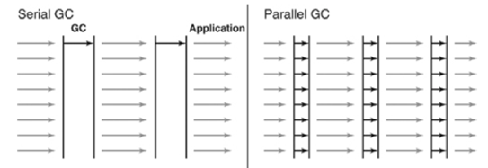
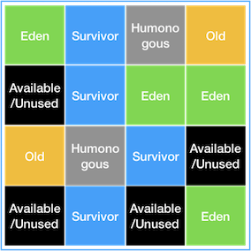
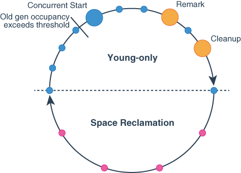

## JDK11의 GC 알고리즘
---
Old 영역은 기본적으로 데이터가 가득 차면 GC를 수행한다. GC 방식은 JDK7을 기준으로 5가지 방식이 있다.

- Serial GC
- Parallel GC
- Parallel Old GC(Parallel Compacting GC)
- Concurrent Mark & Sweep GC(이하 CMS)
- G1(Garbage First) GC

그러나 대부분 오래된 GC 방식이고 Serial GC의 경우 매우 기본적인 GC 이므로 이 글에서는 생략할 것이다.

나는 Java 진영에서 지원하는 LTS 버전인 JDK8과 JDK11의 Default GC 알고리즘에 대해서 살펴 볼 것이고 각각 ```Parallel GC```와 ```G1GC```가 되겠다.

<br>

## Parrallel GC (-XX:+UseParallelGC)
---
현재 가장 많이 쓰이는 JDK8의 Default GC인 Parrallel GC는 Serial GC와 기본적인 알고리즘은 같다. 그러나 Serial GC는 단일 스레드인 것에 비해 Parrallel GC는 병렬 스레드를 사용한다. 따라서 메모리가 충분하고 코어의 개수가 많을 때 더 유리한 알고리즘이다. Parallel GC는 Throughput GC라고도 부른다.

기본적인 알고리즘은 같기 때문에 ```Mark-Sweep-Compact``` 알고리즘을 이용한다.



<br>

## G1GC(-XX:+UseG1GC)
---
G1GC는 JDK11 부터 공식적인 GC 알고리즘으로 적용되었고, 하드웨어가 점점 발전하면서 대용량 메모리에 적합한 솔루션을 제공하기 위해 나타났다.

G1GC에도 Eden, Survivor, Old 영역이 존재하지만, 해당 영역은 고정된 크기가 아니며 전체 Heap 메모리 영역을 특정한 크기로 나눈 것이다.

G1GC의 특징은 아래와 같다.



- **Humonogous**: Region 크기의 50%를 초과하는 큰 객체를 저장하기 위한 공간
- **Available/Unused**: 아직 사용되지 않은 Region
  
<br>

- 비어 있는 영역에만 새로운 객체가 들어간다.
- 꽉 찬 영역을 우선적으로 청소한다.
  - reachable 한 객체를 다른 영역으로 옮기고, 해당 영역을 청소한다.
  - 이렇게 옮기는 과정이 조각 모음의 역할도 한다.
  - 예를들어 Eden 영역이 꽉 차면 Survivor 영역으로 옮기고 Edne은 비워버린다. 

<br>

- G1GC는 STW(Stop The World) 시간을 줄이기 위해 병렬로 GC 작업을 수행한다. 각각의 스레드가 자신만의 영역에서 작업하는 방식이다.
  - 영역의 크기는 1MB ~ 32MB 까지 다양하다. 목표는 2048개 이하의 영역(Eden, Survivor, Old, ...)을 보유하는 것이다.

<br>

- G1GC는 soft real time이라고 하는 목표 정지 시간이 있다. 
  - young collection이 수행될 때, 해당 soft real time을 충족하기 위해 young region(Eden, Survivor)의 크기를 조정한다.
  - mixed collection이 수행될 때, (mixed garbage 수집 목표치), (활성 객체의 비율), (허용 가능한 전체 힙 낭비 비율) 을 기준으로 수집되는 Old 영역의 수를 조정한다.

<br>

- G1GC는 영역을 청소하면서 (활성 객체를 이동시킴) 영역 압축을 수행하기 때문에 힙 조각화를 최소화한다.
  - 가능한 한 많은 힙 영역을 회수해서 정지 시간을 최소화하는 것이 목표이다.
 
<br>

- G1GC는 RSets(independent Remembered Sets)을 이용하여 영역의 참조를 추적한다.
  - 이는 전체 힙을 스캔하지 않고도 해당 영역의 참조를 확인할 수 있게 한다.
  - 힙의 변경 사항이 발생하면 RSets을 업데이트하여 유지한다.

<br>

### Garbage Collection Cycle
---

G1GC는 크게 두 가지 페이즈를 반복한다. 
- ```young-only 페이즈```: 현재 사용 가능한 메모리를 old generation으로 점차 채우는 작업을 수행한다. 
- ```space-reclamation 페이즈```: young generation과 old generation을 회수하는 작업을 수행한다.



더 자세히 알아보자.
1. ```Young-only phase```: 이 페이즈는 young 객체들을 old 객체로 전환하면서 시작된다. 만약 old 객체의 비율이 특정 임계값을 넘어가게 되면, young-only 페이즈에서 space-reclamation 페이즈로 전환된다. 이때 G1은 initial Mark 라는 동작을 수행한다. 즉, 아래의 세 가지 과정은 페이즈가 전환되기 위해 거쳐야 하는 일련의 절차라고 볼 수 있다.
   - ```initial Mark```: Old generation 영역에 대하여 reachable한 객체에 마킹을 수행한다. 이는 space-reclamation 페이즈에서 객체가 살아남을 수 있도록 한다. initial 마킹이 수행되는 중간에도 young 영역에 대해서 쓰레기 수집이 발생할 수 있다. 
     - initial 마킹은 Remark 단계, Cleanup 단계에 의해 마무리 된다.
   - ```Remark``` (STW 발생): 마킹 자체를 완료하고 글로벌 참조 처리(?)와 클래스 언로딩을 수행한다. Remark 과정과 Cleanup 과정 사이에서 G1은 Liveness information 요약을 동시에 계산하며, 해당 정보는 Cleanup 과정에서 사용된다.
   - ```Cleanup``` (STW 발생): 완전히 빈 영역을 회수하고, space-reclamation 페이즈로 넘어갈지 실질적으로 결정하는 단계이다.

2. ```Space-reclamation phase```: 이 페이즈는 young, old generation에 대한 수집과 정리가 이루어지는 단계이다. 즉 region의 조각 모음도 수행되어 진다고 볼 수 있다. 이 페이즈는 old generation 영역을 더 이상 evacuating 하지 않아도 된다고 판단하면 마무리 된다. 

G1이 Liveness information을 수집하다가도 메모리가 부족해지면 다른 GC 알고리즘처럼 Full GC(Major GC)를 수행한다. 

<br>

> 추가적으로 내부 구조에 대한 해석이 있는데, 아직 내가 읽을 레벨은 아닌 것 같아서 보류

> 이 글은 부정확한 의역과 해석이 있을 수 있습니다. 더 정확한 내용은 아래 참조 링크를 확인하세요.

Ref
---
- G1 cycle 참조: https://docs.oracle.com/javase/9/gctuning/garbage-first-garbage-collector.htm#JSGCT-GUID-C268549C-7D95-499C-9B24-A6670B44E49C
- G1 특징 참조: https://www.oracle.com/technical-resources/articles/java/g1gc.html
- Parrallel GC 참조: https://d2.naver.com/helloworld/1329