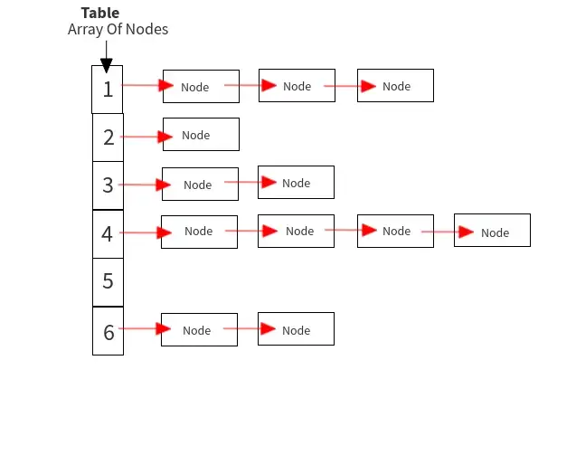

자바의 모든 클래스는 Object 클래스를 상속받습니다. 

그리고 Object클래스에는 equals() 와 hashCode() 라는 메소드가 선언되어 있습니다. 

이 메소드들은 각각 어떤 역할일까요? 이 둘의 차이점은 무엇일까요?

<br>

### equals()
---

자바의 equals()는 객체의 동일성 또는 동등성 비교를 수행한다. 

동일성 비교란 객체의 참조값(주소값)이 같은지 "==" 연산자를 통해 비교하는 것을 말한다.

Java에서 primitive type의 경우 runtime constant pool에 저장된 값을 공유한다. 따라서 객체의 참조값이 같을 경우 값도 같다고 볼 수 있기 때문에 동일성, 동등성 비교가 동시에 가능하다.

반면에 reference type의 경우 힙에 저장된 객체의 참조값이 모두 다르기 때문에 서로 다른 두 객체 간의 동일성 비교는 항상 같지 않다를 반환할 것이다.

그러나 서로 다른 두 객체의 논리적 비교인 동등성 비교를 하고 싶을 수도 있다. 이땐 equals()의 재정의가 필요하다. equals()를 재정의하여 객체의 내부 값을 직접 비교해서 동등성 비교를 수행하도록 할 수 있다.

<br>

### hashcode()
---

자바의 hashcode()는 해시 함수를 통해 객체의 고유한 해시값을 반환하는 메서드이다.

재정의하지 않을 경우 객체의 참조값과 관련된 정수값이 반환되는 것으로 알려져 있다.

동등성 비교를 수행하기 위해 hashcode()를 호출하기도 하며, 이 경우 논리적으로 동등한 객체는 같은 hashcode를 반환하도록 hashcode() 재정의가 필요하다.

hashcode()는 대표적으로 자바의 HashMap에서 쓰인다. 만약 hashcode()가 동등하지 않은 객체에 대하여 같은 hashcode를 반환하게 해서 해시 충돌이 발생할 경우 HashMap의 성능이 저하될 수 있다.

HashMap은 해시 충돌이 발생할 경우 Seperate Chaining 방식으로 해결한다. Seperate Chaining 방식은 연결리스트를 사용하는 방식으로 충돌한 키(인덱스)에 여러 요소(노드)가 들어갈 수 있도록 한다.

```Java
index
  [3] --> null
  [2] --> [노드1] --> [노드2] --> [노드3]  // 2번의 충돌 발생
  [1] --> null
```

따라서 각 노드(요소)는 다음 노드를 가리킬 수 있어야 하며, 이는 연결리스트의 구조와 같다.

노드는 아래와 같이 정의되어 있다.

```Java
static class Node<K,V> implements Map.Entry<K,V> {
    final int hash;
    final K key;
    V value;
    Node<K,V> next;
    ...
}
```

연결리스트의 경우 탐색에 O(N)의 시간이 걸리기 때문에 hashcode()를 잘못 재정의할 경우 같은 키에 여러 노드가 연결리스트를 구성하게 되고 HashMap의 성능은 점차 낮아질 것이다.

다시 그림으로 정리해보면 아래와 같다.



---

<br>

만약 충돌이 발생할 가능성이 높은데도 불구하고 연결리스트 형태로만 충돌을 관리하면, 언젠가는 성능이 매우 낮아질 것이다.

따라서 HashMap은 정해진 임계점을 넘는 순간 연결리스트에서 Red-Black-Tree로 관리 형태를 변환한다.

아래는 HashMap의 putVal이라는 함수의 일부분이다.

```Java
if ((e = p.next) == null) {
    p.next = newNode(hash, key, value, null);
    if (binCount >= TREEIFY_THRESHOLD - 1) // -1 for 1st
        treeifyBin(tab, hash);
    break;
}
```

binCount가 TREEIFY_THRESHOLD - 1 보다 크거나 같아지면 treeifyBin()을 수행하여 Red-Black-Tree로 관리 형태를 전환하고 있다.

만약 Red-Balck-Tree로 관리 형태를 전환하고 싶다면 단순한 노드로는 Red-Black-Tree를 구현 할 수 없다.

따라서 Red-Balck-Tree의 구현이 가능하도록 기존 Node의 기능을 확장한 TreeNode라는 자식 클래스를 이용한다.

TreeNode는 아래와 같이 구현되어 있다.

```Java
static final class TreeNode<K,V> extends LinkedHashMap.Entry<K,V> {
    TreeNode<K,V> parent;  // red-black tree links
    TreeNode<K,V> left;
    TreeNode<K,V> right;
    TreeNode<K,V> prev;    // needed to unlink next upon deletion
    boolean red;
    ...
}
```

결국 treeifyBin()에서는 연결리스트를 구성하고 있는 노드들을 TreeNode 객체로 변환하는 작업을 수행하고, 관리 형태를 Red-Black-Tree로 전환한다고 볼 수 있다.

Red-Black-Tree는 탐색 시간 복잡도가 O(log n)이기 때문에 기존의 연결리스트 방식 보다는 더 효율적으로 해시 충돌을 관리할 수 있다.

<br>

### Ref
---
https://lordofkangs.tistory.com/78

https://www.youtube.com/watch?time_continue=3&v=SHdYv41iCmE&feature=emb_title

