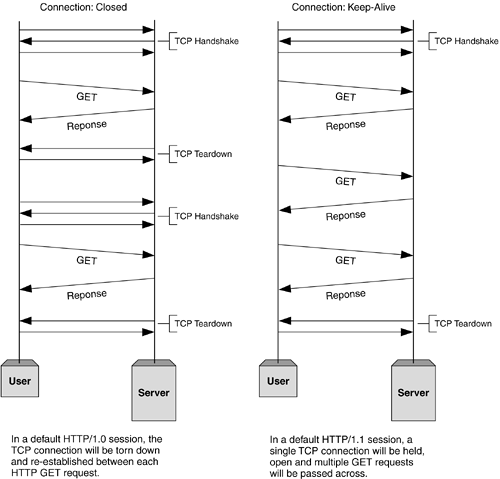
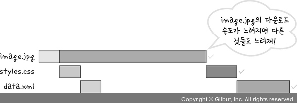
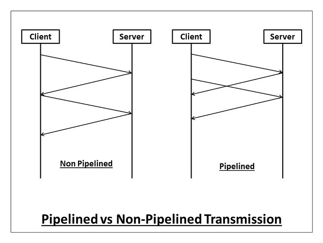
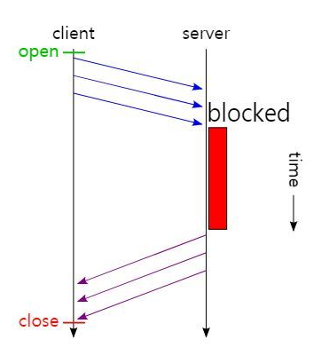

### HTTP1과 HTTP2의 차이에 대해서 말해주세요
---
"HTTP1은 HTTP 1.0과 1.1로 나눠지며 이러한 프로토콜이 발전되어 HTTP 2.0이 되었습니다"... 로 답변 시작

<br>

### HTTP 1.0
---
HTTP 1.0은 기본적으로 한 연결당 하나의 요청을 처리하도록 설계되었습니다. 이는 전체 RTT가 증가하는 단점이 있었습니다.

> 서버로부터 파일을 가져올 때마다 TCP의 3-way 핸드셰이크를 반복해야 하기 때문에 전체 RTT가 증가합니다.

```
RTT란
- 패킷이 목적지에 도달하고 나서 다시 출발지로 돌아오기까지 걸리는 시간이며, 패킷 왕복 시간이라고 이해하면 된다.
```

<br>

RTT 증가를 해결하기 위한 방법

1. 이미지 스플리팅
   - 많은 이미지를 하나로 합쳐서 전송하고, CSS를 통해 이미지를 표기하는 방법이다.

2. 코드 압축
   - 코드를 압축하여 코드 크기를 최소화하는 방법이다. 현재 프론트엔드 쪽도 빌드 파일에 대해서는 자동으로 코드를 압축해주는 것으로 알고 있다.

3. 이미지 Base64 인코딩
   - 이미지 자체를 인코딩하여 HTML에 포함시키는 방법이다. 이렇게하면 이미지를 다운 받을 필요가 없으나, HTML 파일의 크기가 37% 정도 커지는 단점이 있다.

<br>

### HTTP 1.1
---
HTTP 1.0과 다르게 매번 TCP 연결을 하는 것이 아니라 한 번 TCP 연결을 맺고 keep-alive라는 옵션으로 하나의 커넥션에서 여러 개의 파일을 송수신할 수 있게 바뀌었다. 
```
참고로 HTTP 1.0에도 keep-alive 옵션이 있었으나, HTTP 1.1부터 기본 옵션으로 표준화 되었다.

keep-alive 옵션으로 연결을 맺은 커넥션을 Persistent Connection이라고 하는 듯 하다.
```



<br>

하지만 이 방식 또한 문서 안에 포함된 다수의 리소스를 처리하려면 요청할 리소스 개수에 비례해서 대기 시간이 길어진다는 단점이 있다. 



<br>

따라서 HTTP 1.1은 브라우저가 각 HTTP Request에 대한 Response 들을 순차적으로 기다리는 문제를 해결하기 위해 여러 요청들에 대한 응답 처리를 뒤로 미루는 방법을 사용했다. 이것을 HTTP Pipelining 이라고 한다.



<br>

즉, HTTP 1.1에서 클라이언트는 각 요청에 대한 응답을 기다리지 않고, 여러 개의 HTTP Request를 하나의 TCP/IP Packet으로 연속적으로 Packing 해서 요청을 전송한다.

하지만 이러나 저러나 결국 응답처리를 미루는 방식이고, 완전한 멀티플렉싱 방식이 아니기 때문에 각 응답의 처리는 순차적으로 처리되며, 결국 후순위의 응답은 지연된다. 



<br>

이는 HTTP의 Head Of Line Blocking이라고 부르며, Pipelining의 큰 문제점이다.

<br>

**HOL Blocking**

```HOL Blocking(Head Of Line Blocking)```은 네트워크에서 같은 큐에 있는 패킷이 다른 패킷에 의해 지연될 때 발생하는 성능 저하 현상을 말한다. 

<br>

**무거운 헤더 구조**

그리고 HTTP 1.1의 헤더에는 쿠키 등 많은 메타데이터가 들어 있고 압축이 되지 않아 무겁다는 단점도 있다.

<br>

**HTTP 1.1 정리**

HTTP 1.1은 keep-alive 옵션을 이용한 Persistence Connection과 HTTP Pipelining을 통해 성능 향상을 이루었지만, HOL Blocking 문제와 무거운 헤더 구조로 인한 성능 저하 문제가 있다.

<br>

### HTTP 2.0
---
HTTP 2.0은 기존 HTTP 1 버전 대의 성능 향상에 초점을 맞췄다. HTTP 1.1 보다 지연 시간을 줄이고 응답 시간을 더 빠르게 할 수 있으며 멀티플렉싱, 헤더 압축, 서버 푸시, 우선순위 처리를 지원하는 프로토콜이다.

<br>

지원하는 여러 기능들을 살펴보기 앞서 기존 HTTP 메시지 전송 방식의 변화에 대해서 살펴보자. 기존 메시지 전송은 일반 텍스트 형식의 메시지를 전송했다. HTTP 2.0은 ```바이너리 프레이밍```이라는 계층을 통해 해당 메시지를 프레임 단위의 데이터로 쪼개고 바이너리 인코딩을 적용하였다. 결과적으로 파싱, 전송 속도가 향상되었고 오류 발생 가능성이 낮아졌다. 

<br>

**멀티플렉싱**

멀티플렉싱이란 여러 개의 스트림을 사용하여 송수신한다는 것이다. 이를 통해 특정 스트림의 패킷이 손실되었다고 하더라도 해당 스트림에만 영향을 미치고 나머지 스트림은 멀쩡하게 동작할 수 있다.

```
스트림
- 시간이 지남에 따라 사용할 수 있게 되는 일련의 데이터 요소를 가리키는 "데이터 흐름"
```

즉, 여러 개의 스트림을 이용하여 병렬적으로 데이터를 주고 받으며, 메시지를 독립된 프레임으로 조각내어 서로 송수신한 이후 다시 조립하며 데이터를 주고받는다.

결과적으로 HTTP 1.1의 HOL Blocking 문제를 병렬 스트림을 통해 해결하였고, 더 효율적인 데이터 송수신이 가능해졌다. 

**그러나!**

```
> 완벽히 모든 문제가 해결된 것은 아니다..HTTP 2.0은 TCP를 사용하기 때문에 HOL Blocking과 유사한 문제를 여전히 겪고 있다. 
TCP는 패킷을 손실하면 유실된 패킷에 대한 ACK이 도착하지 않는다. 따라서 송신 측은 데이터를 다시 전송하는데, 
수신 측에서는 도착하지 않은 패킷이 있으므로 다른 패킷이 도착하더라도 데이터 스트림을 조립하지 못한다.

즉, TCP 레벨에서 HOL Blocking과 비슷한 문제를 여전히 겪고 있는 것이다. 이는 하나의 TCP chain을 이용하기 때문에 발생하는 문제이다.
```


<br>

**헤더 압축**

헤더의 크기를 줄여 페이지 로드 시간을 감소시켰다. 헤더 압축은 허프만 코딩 압축 알고리즘을 사용하는 HPACK 압축 형식을 이용한다.

```
허프만 코딩은 문자열을 문자 단위로 쪼개 빈도수를 세어 빈도가 높은 정보는 적은 비트 수를 사용하여 표현하고, 빈도가 낮은 정보는 비트 수를 많이 사용하여 표현해서 전체 데이터의 표현에 필요한 비트양을 줄이는 원리이다.
```

<br>

**서버 푸시**

HTTP 2.0에서는 클라이언트 요청 없이 서버가 바로 리소스를 푸시할 수 있다. (알잘딱깔센 ㅋㅋ) 따라서 클라이언트는 불필요한 요청 과정을 줄일 수 있다. 

<br>

**우선순위 처리**

리소스에 우선순위를 설정하여 더 중요한 리소스를 먼저 보낼 수 있도록 한다. 예를들어 IMG를 전송하느라 CSS 파일의 전송이 늦어지면 렌더링 속도가 느려지기 때문에 CSS 파일을 먼저 보낼 수 있도록 우선순위를 설정한다.

<br>

### 예상 질문
---

<details>
<summary>HTTP 1.0에 대해서 설명해주세요</summary>
<div markdown="1">

- HTTP 1.0은 한 연결당 하나의 요청을 처리하도록 설계되어 있는 프로토콜입니다. 매번 TCP/IP 연결을 맺기 때문에 전체 RTT가 증가한다는 단점이 있습니다.

</div>
</details>

<details>
<summary>[꼬리 질문] 해결할 수 있는 방법은요?</summary>
<div markdown="1">

- 해결 방법으로는 이미지 스플리팅, 코드 압축, 이미지 Base64 인코딩 방식이 있습니다. 이미지 스플리팅은 여러 이미지를 하나로 압축해서 사용하는 방법입니다. 코드 압축은 불필요한 코드 공백과 줄바꿈을 제거하는 방법입니다. 이미지 Base64 인코딩 방식은 이미지를 Base64로 인코딩하여 HTML에 이미지를 주입하는 방법입니다.

</div>
</details>

<br>

<details>
<summary>HTTP 1.1에 대해서 설명해주세요</summary>
<div markdown="1">

- HTTP 1.1은 HTTP 1.0과 다르게 하나의 커넥션으로 여러 개의 파일을 송수신할 수 있습니다.

</div>
</details>

<details>
<summary>[꼬리 질문] 어떻게 그게 가능하죠?</summary>
<div markdown="1">

- TCP의 keep-alive 옵션을 이용해서 커넥션을 계속 유지시키기 때문입니다.

</div>
</details>

<details>
<summary>[꼬리 질문] 단점은 없나요?</summary>
<div markdown="1">

- HTTP 1.1은 HTTP Pipelining을 이용하는데, HOL Blocking 문제가 발생한다는 단점이 있습니다.

</div>
</details>

<details>
<summary>[꼬리 질문] 말씀하신 문제에 대해서 설명해주세요</summary>
<div markdown="1">

- HOL Blocking은 Head Of Line Blocking이라고 하며, 네트워크에서 같은 큐에 있는 패킷이 다른 패킷에 의해 지연될 때 발생하는 성능 저하 현상을 말합니다.

</div>
</details>

<br>

<details>
<summary>HTTP 2.0에 대해서 설명해주세요</summary>
<div markdown="1">

- HTTP 2.0은 HTTP 1의 성능을 개선한 프로토콜입니다. 멀티플렉싱, 헤더 압축, 서버 푸시, 우선순위 처리를 지원합니다.

</div>
</details>

<details>
<summary>[꼬리 질문] 각 기능에 대해서 설명해주세요</summary>
<div markdown="1">

- 본문 참조

</div>
</details>

<details>
<summary>[꼬리 질문] 2.0에서는 HOL Blocking 문제가 해결되었나요?</summary>
<div markdown="1">

- HTTP 1.1이 겪은 문제는 HTTP 멀티플렉싱을 이용하여 해결했으나 TCP 수준에서 HOL Blocking과 유사한 문제가 여전히 발생합니다. 

</div>
</details>
