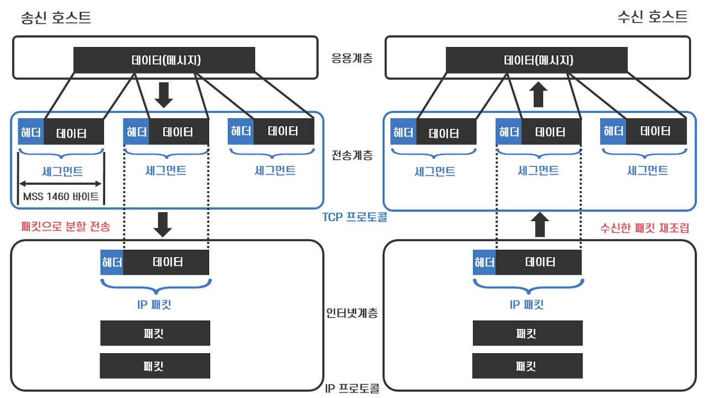
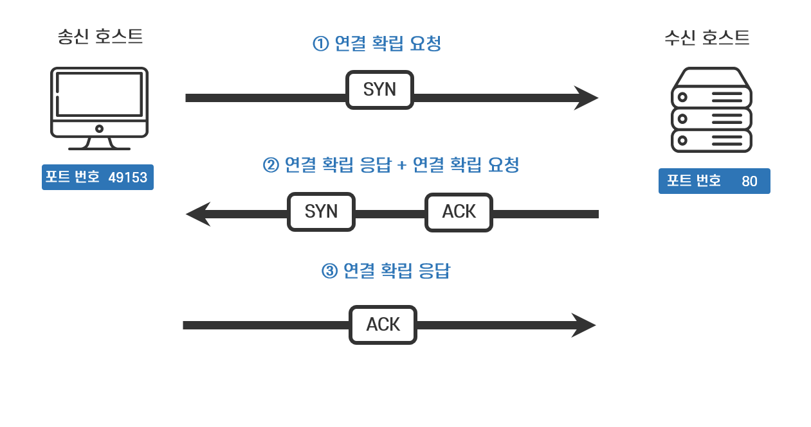
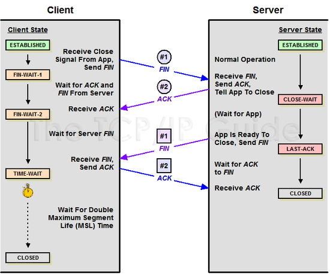
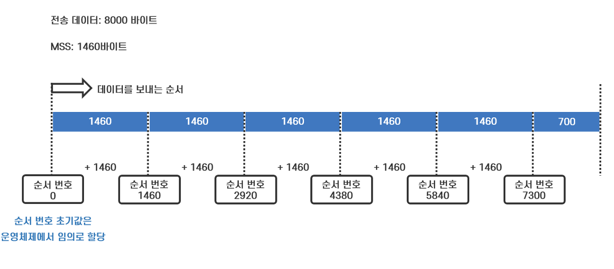
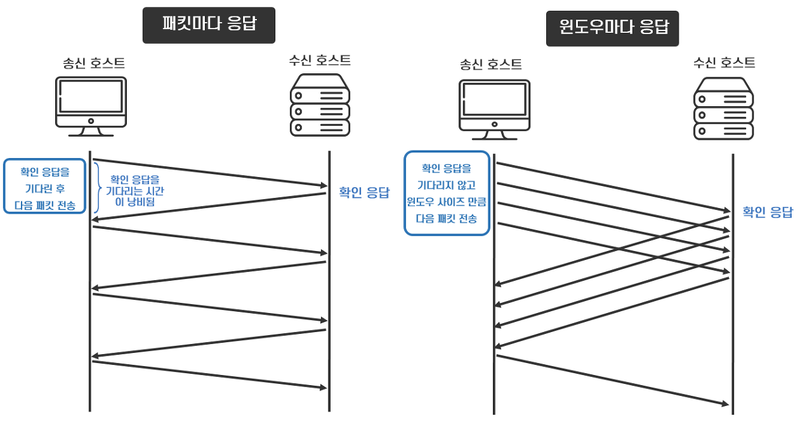
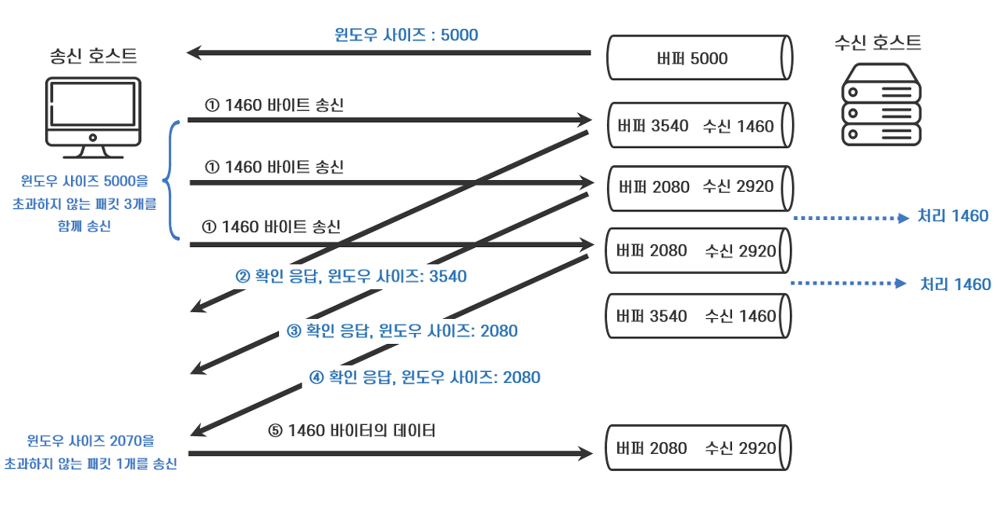

### TCP
---
TCP는 전송 계층의 대표적인 프로토콜이며, 여러 기능을 통해 데이터 전송의 신뢰성을 보장한다.

 

### TCP 패킷 분할과 조립
---
TCP는 응용 계층의 데이터를 받아 작은 조각으로 분할하고 TCP 헤더를 붙은 세그먼트라는 데이터 단위를 이용한다.

MSS(Maximum Segment Size)를 기준으로 데이터를 분할하며, MSS는 송신지와 수신지가 합의하에 결정한다. 일반적인 MSS 사이즈는 1,460 바이트이다.

또한 분할된 데이터에 Sequence Number를 부여하여 전송 과정에서 순서가 뒤바뀌더라도 원래의 데이터로 재조립이 가능하다.

 
 

## TCP 통신 과정

 

### 1. 연결 확립
---

연결 확립을 통해 애플리케이션 간에 일대일 통신을 할 수 있는 가상 연결 통로를 만든다.

연결 확립은 3-way 핸드 셰이크를 통해 확립된다. 통신을 하려면 수신 호스트의 허락을 받아야 하므로 **연결 확립 요청(SYN)**을 전송한다. 데이터 없이 TCP 헤더만으로 구성된 커넥션 확립 요청 패킷을 보내는 방식으로 이루어진다.

수신 호스트는 연결 확립을 허가하기 위해 **연결 확립 응답** 코드 ACK을 TCP 헤더에 담은 패킷을 전송한다. 또한 수신 호스트도 데이터 전송을 허가 받기 위해 연결 확립 요청을 전송한다.

송신 호스트는 데이터 전송을 허가한다는 의미로 연결 확립 응답(ACK)을 보내면서 3-way 핸드 셰이크는 마무리 된다.

참고
- 위 과정에서 MSS가 결정된다.
  - 각 호스트는 연결 확립 요청을 보낼 때 TCP 헤더에 MSS 옵션을 붙여 자신의 통신 환경에 적합한 MSS를 통지한다. 양쪽의 값 중에 적은 값이 MSS로 사용된다. 
- 분할된 데이터가 몇 번째 데이터인지 알려 주는 역할을 하는 순서 번호의 초깃값도 연결 과정에서 32비트로 구성된 임의의 숫자로 결정된다.

 

### 2. 연결 해제
---

연결 종료에는 FIN과 ACK 코드를 사용한다. 먼저 송신 호스트가 수신 호스트로 연결 종료 요청 FIN을 전송한다.

수신 호스트는 연결 종료 응답 ACK을 반환하고, 동시에 연결 종료 요청 FIN을 전송한다.

송신 호스트는 응답으로 연결 종료 응답 ACK을 반환한다. 이때 뒤늦게 도착하는 패킷들이 있을 수도 있으므로 일정시간 대기한 후 응답 ACK을 반환한다. 

 

### 3. 데이터 전송
---
연결 확립 상태에서 송신 호스트가 데이터를 전송하면 데이터를 수신한 호스트는 반드시 데이터 도착 여부를 확인해서 송신 호스트에게 알려준다.

즉, 확인 응답으로 데이터 도착의 신뢰성을 구현하는 것이다. 확인 응답이란 수신 호스트가 다음에 수신해야할 데이터는 몇 번째 데이터인지 알려주는 번호와 같다.

위 그림에 표현된 데이터 전송 과정을 정리하면 아래와 같다.
- 먼저 MSS가 1460 바이트로 설정되었다.
- 전송 데이터가 8000 바이트이기 때문에 6 조각으로 나뉜다.
- 송신 호스트에서 순서 번호가 0인 첫 번째 패킷을 전송한다.
- 수신 호스트는 그 다음 패킷의 번호를 확인 응답으로 보낸다. (1460)
- 이 과정을 반복한다. 
- 만약 수신 호스트로부터 수신 확인 응답이 오지 않는다면 송신자는 데이터를 재전송한다.

 

### 4. TCP 흐름 제어
---
매번 확인 응답을 기다리면 패킷의 전송 속도가 지연될 것이다. 따라서 TCP는 흐름 제어를 통해 전송 효율을 높이고 있다.

흐름 제어는 패킷 단위가 아닌 윈도우 단위로 확인 응답을 하는 방식으로 진행된다. 즉, 윈도우 사이즈 만큼 패킷을 전송하고 확인 응답을 받음으로써 전송 효율을 높인다.

만약 송신 호스트가 너무 많은 양의 데이터를 한번에 보내면 수신 호스트에서 제때 처리하지 못해 송신 호스트가 같은 데이터를 다시 보내는 일이 발생할 수 있다. 따라서 윈도우 사이즈는 수신 호스트가 한 번에 수신 가능한 버퍼의 크기가 되어야 한다.

또한 수신 호스트의 사정상 성능 저하가 발생할 수 있으므로 이를 송신자는 이를 고려하여 윈도우 사이즈를 상황에 맞게 변경해야 한다. 따라서 수신자는 윈도우 사이즈를 결정해서 이를 송신자에게 알릴 수 있다. 

윈도우 사이즈 또한 3-way 핸드 셰이크 과정에서 설정되며 수신 호스트가 확인 응답을 보낼 때 윈도우 사이즈를 동적으로 결정해 줄 수 있다.

이는 **Back-pressure(배압)** 개념이라고도 볼 수 있다.

