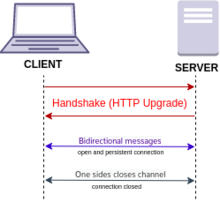

### WebSocket
---

웹소켓은 하나의 TCP 접속에 전이중 통신 채널을 제공하는 컴퓨터 통신 프로토콜이다.

웹소켓은 HTTP와 구별된다. 두 프로토콜 모두 OSI 7계층에 위치해 있으며, 제 4계층에 의존한다. 이들에 차이가 있으나 웹소켓이 HTTP 포트 80과 443 위에 동작하도록 설계되어 있고, HTTP 프록시 및 중간 층을 지원하도록 설계되었으므로 HTTP 프로토콜과 호환된다.

호환을 달성하기 위해 웹소켓 핸드셰이크는 HTTP 업그레이드 헤더를 사용하여 HTTP 프로토콜에서 웹소켓 프로토콜로 변경한다.

웹소켓 프로토콜은 HTTP 폴링과 같은 반이중방식에 비해 더 낮은 부하를 사용하여 통신을 가능케 하며, 서버와의 실시간 데이터 전송을 용이하게 한다.

즉 **전이중 통신**을 이용한다.

 

### 단점
---

1. 브라우저 중 버전에 따라 지원을 안하는 경우가 있다.
   - 하지만 MDN 문서에 따르면 현재 대부분 지원하는 것으로 보인다.
   - 혹시나 지원하지 않는 브라우저에 대해서도 Websocket 통신이 가능하도록 websocket emulation 라이브러리를 이용하는 방법도 있다.
     - 해당 라이브러리는 Websocket을 지원하지 않을 때 HTTP Streaming, pooling 같은 HTTP 기반의 다른 기술을 통해 통신이 가능하도록 하는 라이브러리이다.

2. Stateful
   - 웹소켓은 하나의 커넥션으로 계속해서 통신하기 때문에 서버와 클라이언트가 항상 연결을 유지해야 한다.
   - 이를 유지하기 위해서는 서버에 부하가 발생하고, 비정상적인 연결 종료 시에는 적절한 대처가 필요하다.