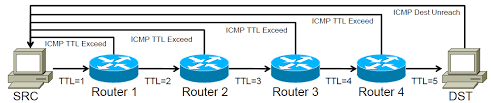
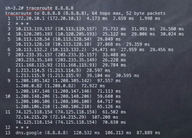

```
병목 현상은 전체 시스템의 성능이나 용량이 하나의 구성 요소로 인해 제한을 받는 현상이다.
```
네트워크 병목 현상의 원인은 주로 다음과 같다.

- 네트워크 대역폭
  - 주어진 시간 동안 네트워크 연결을 통해 흐를 수 있는 최대 비트 수
- 네트워크 토폴로지
  - 네트워크 상의 노드와 링크가 어떻게 배치되어 있는지에 대한 방식이자 연결 형태
- 서버 CPU, 메모리 사용량
- 비효율적인 네트워크 구성

<br>

네트워크로부터 발생한 문제점인 것이 확인되면 네트워크 성능 분석을 진행해야 한다. 이때 사용하는 명령어들을 알아보자.

<br>

### 성능 분석 명령어
---
**ping**
  - 네트워크 상태를 확인하려는 대상 노들를 향해 일정 크기의 패킷을 전송하는 명령어이다. 대상 노드의 패킷 수신 상태와 도달하기까지 시간 등을 알 수 있으며, 해당 노드까지 네트워크가 잘 연결되어 있는지 확인할 수 있다.
  - TCP/IP 프로토콜 중 ICMP 프로토콜을 통해 동작하며, 이 때문에 ICMP 프로토콜을 지원하지 않는 기기를 대상으로는 실행할 수 없고, 정책상 ICMP나 traceroute를 차단하는 대상의 경우 ping 테스트는 불가능하다.

EX
```
ping [IP or Domain] -option
```

<br>

---

**netstat**
 - 접속되어 있는 서비스들의 네트워크 상태를 표시하는 데 사용되며 네트워크 접속, 라우팅 테이블, 네트워크 프로토콜 등 리스트를 보여준다. 주로 서비스의 포트가 열려 있는지 확인할 때 사용한다.

<br>

---

**nslookup**
 - nslookup은 DNS에 관련된 내용을 확인하기 위해 쓰는 명령어이다. 특정 도메인에 매핑된 IP를 확인하기 위해 사용한다.

<br>

---

**tracert**
 - 윈도우는 tracert이고 리눅스에서는 traceroute라는 명령어로 구동한다.
 - 목적지 노드까지 네트워크 경로를 확인할 때 사용하는 명령어이다.
 - 목적지 노드까지 구간들 중 어느 구간에서 응답 시간이 느려지는지 등을 확인할 수 있다.

```
한 번 테스트해보자. google의 dns 주소인 8.8.8.8을 목적지로 설정하여 진행해보겠다.

-----------------------------------------------------------

최대 30홉 이상의
dns.google [8.8.8.8](으)로 가는 경로 추적:

  1    <1 ms    <1 ms    <1 ms  192.168.219.1
  2     *        *        *     요청 시간이 만료되었습니다.
  3     1 ms     1 ms     1 ms  10.50.238.85
  4     *        2 ms     1 ms  1.208.21.157
  5     5 ms     5 ms     6 ms  1.208.167.133
  6     5 ms     5 ms     4 ms  1.208.145.18
  7     4 ms     4 ms     3 ms  1.213.114.9
  8    42 ms    42 ms    42 ms  1.208.144.106
  9    43 ms    44 ms    43 ms  1.208.106.106
 10    43 ms    43 ms    43 ms  72.14.215.29
 11    42 ms    43 ms    42 ms  209.85.244.25
 12    41 ms    42 ms    42 ms  142.251.245.15
 13    44 ms    43 ms    44 ms  dns.google [8.8.8.8]

추적을 완료했습니다.

-----------------------------------------------------------

4번 부터 살펴보자. WHOIS를 통해 조회해보니 우리 집이 이용하는 ISP인 엘지유플러스가 나온다.

10번 부터는 구글의 망을 이용하는 것으로 보인다.

그런데 이걸 어떻게 기록하는걸까?

```

**tracert 더 자세히 알아보자**



- Probe Packet을 보내서 TTL을 높혀 가며 경로(Hop)을 파악한다.
  - TTL 만료 시 Time-to-live exceeded 메세지가 반환됨
  - 이러한 응답을 기록하여 사용자에게 네트워크 경로를 보여줄 수 있다.
  
<br>

- Probe 용으로 ICMP, UDP, TCP 다 사용이 가능하다.
  - TCP의 경우 보안상 패킷이 가로막혀 응답이 오지 않는 경우가 있다.
  - 경로상의 방화벽이나 ACL 등에 의해 filter 가능성   

<br>

- 3개 이상의 Probe 개수를 통해 Multi Path를 파악한다.
  - 위 그림의 경우 경로가 한 가지 뿐이지만 실제로는 굉장히 다양한 경로가 있다.
  - 즉 라우팅에 의해서 다른 경로로 패킷이 가도록 유도하는 방법이다.
  - 따라서 Multi Path 상에서 가는 루트와 돌아오는 루트가 다를 수 있기 때문에 돌아오는 경로는 확인할 수 없다.

<br>

- DNS reverse Query를 통한 HOP 정보를 통한 ISP, 국가 등 확인 가능

<br>

RTT 해석

```
  5     5 ms     5 ms     6 ms  1.208.167.133

1.208.167.133 까지의 RTT가 5ms 라고 볼 수 있다.

 13    44 ms    43 ms    44 ms  dns.google [8.8.8.8]

즉 dns.google 까지의 RTT는 44~43ms 라고 볼 수 있다.

  7     4 ms     4 ms     3 ms  1.213.114.9
  8    42 ms    42 ms    42 ms  1.208.144.106

7 -> 8 로 넘어갈 때 RTT가 확 증가하는 것을 볼 수 있는데, 혼잡도가 증가했기 때문이라고 보면 될까?

구글 DNS 까지는 어떻게 저렇게 빠른거지?

```

이건 한 유투버 분이 9개월 전 google dns에 tracert를 수행한 결과이다.



google dns 까지의 RTT가 많이 개선된(?) 것 같다.

<br>

---

이 외에도 ftp를 통해 대형 파일을 전송하거나 tcpdump를 통해 노드로 오고 가는 패킷을 캡쳐하는 등의 명령어가 있으며, 네트워크 분석 프로그램으로는 wireshark, netmon 등이 있다.