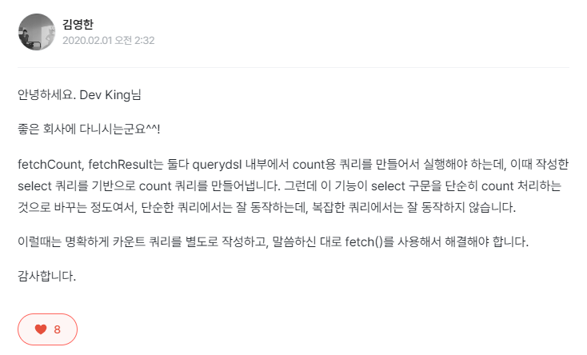

### 결과 조회
---

- fetch(): 리스트 조회, 데이터가 없으면 빈 리스트를 반환한다.
- fetchOne(): 단 건 조회
  - 결과가 없으면 null
  - 결과가 둘 이상이면 ```NonUniqueResultException``` 발생
- fetchFirst(): limit(1).fetchOne()과 동일
- fetchResults(): 페이징 정보 포함, total count 쿼리 추가 실행
- fetchCount(): count 쿼리로 변경해서 count 쿼리 수행

<br>

참고로 fetchResults()의 경우 페이징 쿼리가 복잡해지고, 성능이 중요한 경우에는 사용하지 않는 것이 좋다. 그런 경우에는 컨텐츠 쿼리와 total count 쿼리를 따로 최적화하여 수행하는 것이 좋다. 

<br>

엇 그런데 지금 살펴보니 강의와 다르게 현 버전의 querydsl에서는 fetchResults()가 deprecated 되었다. 이유를 살펴보자.

```
fetchResults requires a count query to be computed. In querydsl-sql, this is done by wrapping the query in a subquery, like so: SELECT COUNT(*) FROM (&lt;original query&gt;). Unfortunately, JPQL - the query language of JPA - does not allow queries to project from subqueries. As a result there isn't a universal way to express count queries in JPQL. Historically QueryDSL attempts at producing a modified query to compute the number of results instead. However, this approach only works for simple queries. Specifically queries with multiple group by clauses and queries with a having clause turn out to be problematic. This is because COUNT(DISTINCT a, b, c), while valid SQL in most dialects, is not valid JPQL. Furthermore, a having clause may refer select elements or aggregate functions and therefore cannot be emulated by moving the predicate to the where clause instead. In order to support fetchResults for queries with multiple group by elements or a having clause, we generate the count in memory instead. This means that the method simply falls back to returning the size of fetch(). For large result sets this may come at a severe performance penalty. For very specific domain models where fetchResults() has to be used in conjunction with complex queries containing multiple group by elements and/or a having clause, we recommend using the Blaze-Persistence  integration for QueryDSL. Among other advanced query features, Blaze-Persistence makes it possible to select from subqueries in JPQL. As a result the BlazeJPAQuery provided with the integration, implements fetchResults properly and always executes a proper count query. Mind that for any scenario where the count is not strictly needed separately, we recommend to use fetch() instead.
```

ㅗㅜㅑ... 너무 긴 영어..

영한님의 답변을 찾아보았다.



역시 명쾌한 답변을 주셨다. 즉 querydsl의 count 방식이 복잡한 쿼리에서는 제대로 동작하지 않는 문제가 있고, 복잡한 쿼리라고 한다면 having, groupby 등을 사용하는 수준의 쿼리라고 보면 된다.

따라서 fetch()를 이용하고, count 쿼리는 직접 날리는 것이 좋을 것 같다.

이는 fetchCount()에도 적용되는 이야기이므로 fetchResults()나 fetchCount()를 이용할 때 참고하도록 하자.