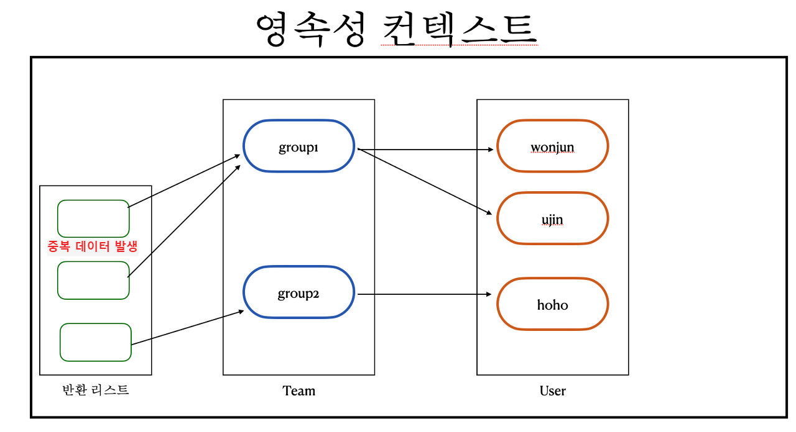

### 조인
---
Team(1) : Member(N) 관계를 가지고 있다.

아래는 Team을 모두 조회하면서 관계가 있는 Member들을 fetch join하는 코드이다.

```Java
@Test
public void join() {

    List<Team> results = queryFactory
            .selectFrom(team)
            .distinct()
            .join(team.members, member)
            .fetchJoin()
            .fetch();

    assertThat(results.size()).isEqualTo(2);
}

// 발생 쿼리
select
    distinct team0_.team_id as team_id1_2_0_,
    members1_.member_id as member_i1_1_1_,
    team0_.name as name2_2_0_,
    members1_.age as age2_1_1_,
    members1_.team_id as team_id4_1_1_,
    members1_.username as username3_1_1_,
    members1_.team_id as team_id4_1_0__,
    members1_.member_id as member_i1_1_0__ 
from
    team team0_ 
inner join
    member members1_ 
        on team0_.team_id=members1_.team_id
```

다대일 양방향 관계에서 주의해야 할 점이 있는데, 일 방향에서 조회를 수행할 때 단순히 join fetch를 이용하면 inner join이 수행되기 때문에 아직 member와 관계를 맺지 않은 team은 조회가 안된다. join 조건에 맞지 않기 때문이다. 이때는 left join fetch를 이용해서 조회해주면 해결할 수 있다.



또한 위 그림처럼 중복이 발생하기 때문에 inner join이던 outter join이던 distinct로 중복을 제거해주는 것을 잊지 말아야 한다.

<br>

### 관계가 없는 필드끼리 조인
---

관계가 전혀 없는 필드끼리 조인을 해보자. theta join이라고도 한다.

```Java
@Test
public void thetaJoin() {

    em.persist(new Member("teamA"));
    em.persist(new Member("teamB"));
    em.flush();
    em.clear();

    List<Member> members = queryFactory
            .select(member)
            .from(member, team)
            .where(member.username.eq(team.name))
            .fetch();

    assertThat(members)
            .extracting("username")
            .containsExactly("teamA", "teamB");
}
```

from 절에 member와 team을 모두 명시함으로써 카티션 곱이 발생하였고, 그 중 member의 이름과 team의 이름이 같은 필드만 골라서 결과로 반환한 것이다.

카티션 곱이 정말 발생했는지 궁금하다면 아래 코드를 보자.

```Java
List<Tuple> members = queryFactory
        .select(member, team)
        .from(member, team)
        .fetch();

members.forEach(System.out::println);

// log

[Member(id=3, username=member1, age=10), Team(id=1, name=teamA)]
[Member(id=3, username=member1, age=10), Team(id=2, name=teamB)]
[Member(id=4, username=member2, age=20), Team(id=1, name=teamA)]
[Member(id=4, username=member2, age=20), Team(id=2, name=teamB)]
[Member(id=5, username=member3, age=30), Team(id=1, name=teamA)]
[Member(id=5, username=member3, age=30), Team(id=2, name=teamB)]
[Member(id=6, username=member4, age=40), Team(id=1, name=teamA)]
[Member(id=6, username=member4, age=40), Team(id=2, name=teamB)]

// 발생 쿼리

select
    member0_.member_id as member_i1_1_0_,
    team1_.team_id as team_id1_2_1_,
    member0_.age as age2_1_0_,
    member0_.team_id as team_id4_1_0_,
    member0_.username as username3_1_0_,
    team1_.name as name2_2_1_ 
from
    member member0_ cross
join
    team team1_
```

실제 쿼리를 살펴보면 cross join이 발생했음을 알 수 있다. cross join은 한쪽 테이블의 모든 행과 다른 쪽 테이블의 모든 행을 조인시킨다.

<br>

또는 left join 이나 inner join을 이용해서도 가능하다. 아래 코드를 보자.

```Java
em.persist(new Member("teamA"));
em.persist(new Member("teamB"));
em.flush();
em.clear();

List<Member> results = queryFactory
        .select(member)
        .from(member)
        .join(team).on(member.username.eq(team.name))
        .fetch();

assertThat(results)
        .extracting("username")
        .containsExactly("teamA", "teamB");
```

left join의 경우 모든 member가 조회되기 때문에 where로 team이 null인 애들을 필터링 해줘야 한다.

```Java
em.persist(new Member("teamA"));
em.persist(new Member("teamB"));
em.flush();
em.clear();

List<Member> results = queryFactory
        .select(member)
        .from(member)
        .leftJoin(team).on(member.username.eq(team.name))
        .where(team.isNotNull())
        .fetch();

results.forEach(System.out::println);

assertThat(results)
        .extracting("username")
        .containsExactly("teamA", "teamB");
```

흠... 그런데 이렇게 조인할 일이 얼마나 있을까

<br>

### inner join vs left join
---

이미 익숙한 문법이라 자세히 다루지는 않으려고 한다.

```Java
List<Tuple> results1 = queryFactory
        .select(member, team)
        .from(member)
        .join(member.team, team)
        .on(team.name.eq("teamA"))
        .fetch();

results1.forEach(System.out::println);

List<Tuple> results2 = queryFactory
        .select(member, team)
        .from(member)
        .leftJoin(member.team, team)
        .on(team.name.eq("teamA"))
        .fetch();

results2.forEach(System.out::println);
```

그냥 inner join의 경우 on 절로 조건을 추가하던 where 절로 조건을 추가하던 결과는 동일하다는 것만 알면 될 것 같다.

outter join의 경우 왼쪽 테이블에 결과가 맞춰지기 때문에 당연히 inner join과 결과가 다르다.

적절한 선택을 하는 것이 중요한데, 만약 기준 테이블의 모든 데이터가 필요하다면 outter join을 사용하면 되는 것이다.

두 테이블 간의 교집합을 구하고 싶다면 inner join을 사용하면 되는 것이다. 