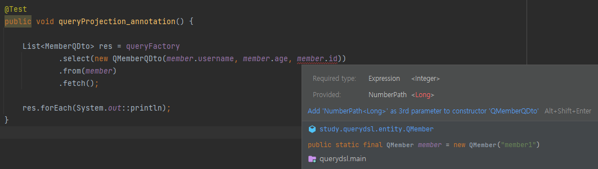

### @QueryProjection
---

@QueryProjection을 DTO의 생성자에 적용하면 DTO에 대한 QClass를 빌드할 수 있다.

```Java
@Data
public class MemberQDto {

    private String username;
    private int age;

    @QueryProjection
    public MemberQDto(String username, int age) {
        this.username = username;
        this.age = age;
    }

    public MemberQDto() {
    }
}
```

생성된 QClass는 아래와 같이 이용할 수 있다.

```Java
List<MemberQDto> res = queryFactory
        .select(new QMemberQDto(member.username, member.age))
        .from(member)
        .fetch();
```

기존의 DTO 생성자 주입 방식과 무슨 차이가 있을까?

일단 생성자를 이용하는 것은 같다. 그러나 생성자 주입 방식은 컴파일 시점에 오류를 잡을 수 없다.

```Java
List<MemberDto> res = queryFactory
        .select(
                Projections.constructor(
                        MemberDto.class,
                        member.username,
                        member.age,
                        member.이런생성자는없어
                )
        )
        .from(member)
        .fetch();

res.forEach(System.out::println);
```

반면에 QClass를 이용하면 컴파일 시점에 오류를 확인할 수 있다.



단점도 있다. DTO로부터 QClass를 생성하기 위해서는 DTO의 생성자에 @QueryProjection 어노테이션을 적용해야 하는데, 

이는 DTO가 querydsl에 의존성을 가진다는 의미가 되며, DTO는 보통 여러 layer에 걸쳐서 이용되기 때문에 많은 layer가 querydsl에 의존성을 가질 수 있다는 의미가 된다.

```Java
import com.querydsl.core.annotations.QueryProjection;
```

사견이지만 DTO는 데이터를 보관하고 옮기는 용도의 객체이므로 querydsl에 의존성을 가지는 것은 바람직하지 않다고 생각한다.