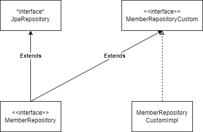

사용자 정의 리포지토리를 이용하여 코드를 작성했기 때문에 별 다른 학습 사항은 없었다.

아래 그림과 같은 구조가 사용자 정의 리포지토리를 이용한 방식이다.

다른 얘기지만 설계적인 관점에서 어떤 쿼리가 기능에 매우 종속적이라면 

해당 쿼리는 따로 분리하여 작성하기도 한다고 한다. 

굳이 하나의 인터페이스에 모두 몰아두는 방식보다는 새로운 리포지토리 클래스를 만들어서 확장한다는 것이다.

[사용자 정의 리포지토리 방식](https://github.com/seaworld0125/TIL/blob/main/JPA/2022-11-30-%EC%82%AC%EC%9A%A9%EC%9E%90-%EC%A0%95%EC%9D%98-%EB%A6%AC%ED%8F%AC%EC%A7%80%ED%86%A0%EB%A6%AC-%EA%B5%AC%ED%98%84.md)은 링크에서 학습할 수 있다.