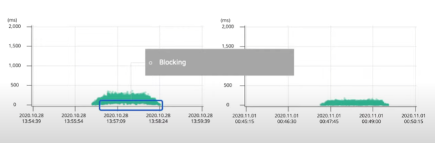
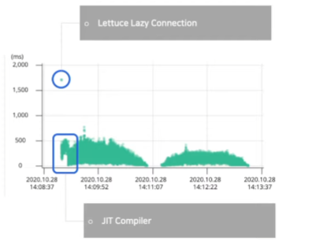
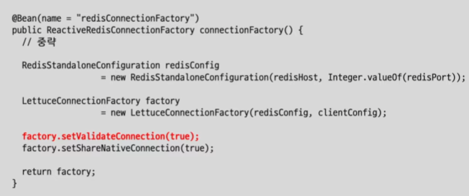
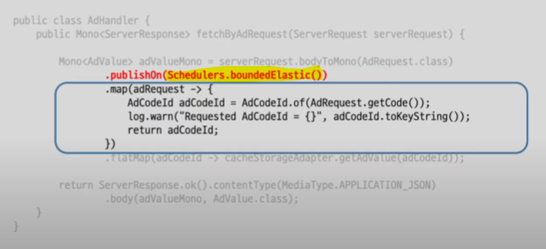

### Ref
---
https://youtu.be/I0zMm6wIbRI

 

### WebFlux를 선택한 이유
---
1. 광고 시스템은 빠른 응답 속도와 높은 처리량이 필요하다.
2. 따라서 저장소는 Redis, API는 Spring WebFlux가 좋은 선택지 같았다.

 

3. Spring MVC는 **Thread Per Request Model**로 구현되어 있다.
   - 즉 서버는 하나의 요청을 처리하기 위해서 하나의 스레드를 사용한다.
     - 스레드가 Blocking 되는 문제가 있다.
     - 스레드가 runnable -> waiting으로 상태가 바뀌는 Context switching이 주는 오버헤드가 부담된다.
     - 톰캣 기본 설정을 이용하면 200 개의 스레드를 사용하는데, 200 개의 스레드가 CPU 자원을 점유하기 위해 경쟁한다.

 

4. Spring WebFlux는 **EventLoop Model**로 구현되어 있다.
   - EventLoop가 Event Queue에 있는 이벤트를 처리하는 구조이다.
   - 내부적으로 비동기/논블로킹으로 동작하기 때문에 적은 스레드로도 동시성을 보장할 수 있다.
     - 그래서 Netty의 경우 CPU Core의 2배 만큼의 스레드만 사용한다.

 

### 내 WebFlux가 느렸던 이유
---
- Blocking I/O를 사용하는 log()를 사용했음

log()를 제거해서 해결하였음

 

- map()과 flagMap()의 차이점
  - map()은 동기식 함수를 적용하여 Mono의 아이템을 변경
  - flatMap()은 비동기식 함수를 적용하여 Mono의 아이템을 변경
  - 너무 많은 map() 메서드 조합은 map() 연산마다 객체를 생성하므로 GC의 대상이 많아진다.
  - 즉 map()을 무분별하게 사용한 것이 문제였다.

무분별한 map() 사용을 줄여서 해결하였음

 

### 성능 측정을 하면서 느낀점
---

1. 죄측 그래프를 보면 하단이 살짝 떠 있는 것을 볼 수 있는데, WebFlux로 개발했음에도 불구하고 Blocking이 발생하고 있다는 것을 의미한다. 문제점을 해결한 뒤 우측 그래프로 개선된 것을 볼 수 있다.

1. Redis Client인 Lettuce는 Lazy 커넥션을 이용한다고 한다. 따라서 초반에 Redis와 커넥션을 맺는 시간이 필요하기 때문에 좌측 상단과 같은 현상이 나타났다.

2. 좌측 하단은 JIT 컴파일러의 최적화 단계이다. 점차 성능이 안정적으로 변하는 것을 볼 수 있다.

 

### 다른 꿀팁
---

**BlockHound**
- Blocking 코드를 찾아주는 라이브러리이다.
- reactor-core 3.3.0 부터 내장되었다.
- block(), blockFirst(), blockLast() 같은 메서드를 사용하면 예외가 발생한다.
  - 테스트 코드를 통해 활용하면 좋다.

 

**Lettuce 설정**
- Lettuce Connection에는 커맨드를 날릴 때 마다 검증하는 설정이 있다.
  - Connection validation 시, Synchronous로 동작한다.
    - 따라서 커맨드를 실행할 때마다 ping command를 동기식으로 실행하여 연결 상태를 검증한다.
    - 성능 이슈의 원인이 될 수 있다.

 

**Avoiding Reactor Meltdown**
- Reactor Meltdown이란
  - Event Loop의 Thread들이 Blocking API 때문에 Reactor 시스템에 Hang이 걸리는 현상이다.
    - 가능하면 모든 코드를 비동기/논블로킹으로 개발하자.
    - 동기식/블로킹으로 개발해야 한다면, 블로킹 콜을 위한 별도의 Thread Pool을 만들자.
      - publishOn()은 다음 메서드 체인을 별도의 스레드 풀에서 실행할 수 있도록 해준다.
      - subscribeOn()은 전체 메서드 체인을 하나의 스레드 풀에서 실행한다.

publishOn()의 인수로 별도 스레드 풀을 전달하는 모습 